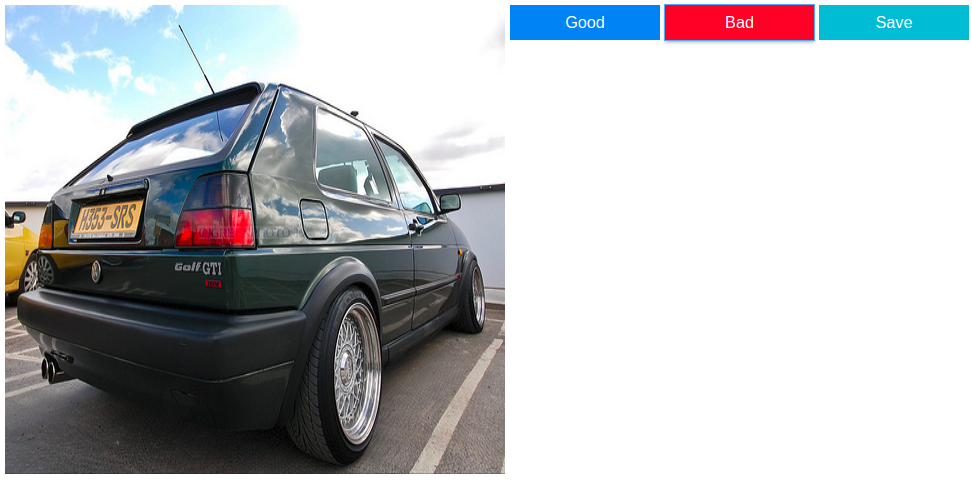

# JupyterImageAnnotator
A simple example of image data annotation in Jupyter Notebook with Jupyter Widgets. This isn't ready-to-use library. This is a template that you can easily customize for your annotation tasks. Advantages of data annotation with Jupyter Widgets:
- ease of data manipulation
- flexible customization of existing logic
- fast experiments
- it's just another Notebook in your project!

For example, it's very easy to add a button with a listener function:
```python
bad_button = widgets.Button(description='Bad', button_style='danger')
bad_button.on_click(on_button_click)
```
Or add a widget with an image:
```python
image_widget = widgets.Image(width=400, height=400)
with open(image_path, 'rb') as f:
    image_widget.value = f.read()
```

## Example project - car annotation
Main requirements:
- annotating the images of cars in two classes: "good" and "bad"(details in the notebook)
- ability to save car ids of different classes into separate files
- ability to continue annotating from the last image after reloading the notebook

All this requirements can be fullfilled in an hour.

The final form interface:


Feel free to use this template in your projects!